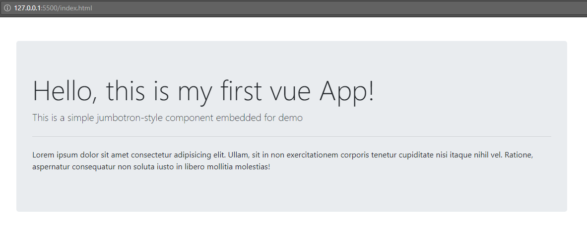

#My First Vue App
- Vue.js is a fast, popular javascript framework for building user interfaces. In the MVC model, it handles the View. It can be used in conjunction with other javascript libraries, or used alone to build SPA's (Single Page Applications).

- 